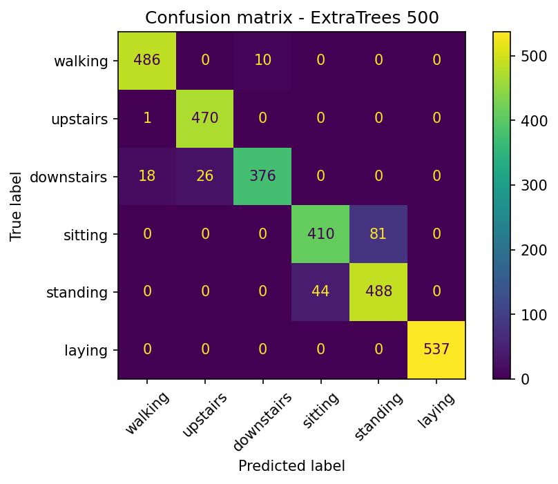
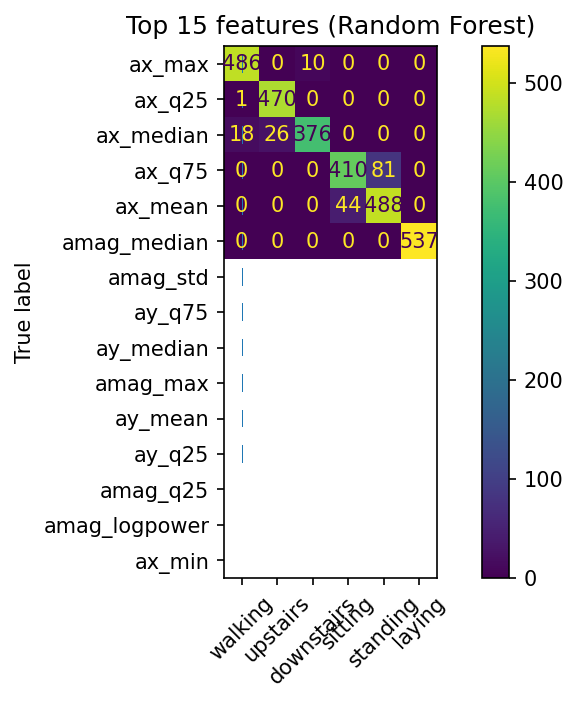

# Human Activity Recognition from Smartphone Sensors

Classifies six everyday activities (walking, walking upstairs, walking downstairs, sitting, standing, laying) from a smartphone's accelerometer and gyroscope signals, using hand-built features and tree-based machine learning.

**Result: 93.9% test accuracy** (Extra Trees), up from an 83% baseline, evaluated on volunteers the model never saw during training.

## Why this project

The goal was to learn the full sensor-to-ML pipeline from scratch: raw IMU signals, windowing, feature engineering, honest evaluation, and error analysis. Each improvement is measured with an ablation study instead of assumed.

## Results

### What each feature family contributed (Random Forest, 200 trees)

| Feature set | # features | Accuracy |
|---|---|---|
| Basic stats (mean, std, min, max, range) | 40 | 0.831 |
| + median / percentiles | 72 | 0.845 |
| + FFT frequency features | 120 | 0.929 |
| + both | 152 | 0.926 |

**Frequency (FFT) features gave the biggest jump (+10 points).** Amplitude statistics tell you how hard the phone is moving; the FFT adds how fast and how regularly it moves, which separates walking from stairs.

### Model comparison (all 152 features)

| Model | Accuracy |
|---|---|
| Random Forest (500 trees) | 0.928 |
| Extra Trees (500 trees) | **0.939** |
| Hist Gradient Boosting | 0.936 |

All three land within about one point, so feature quality mattered far more than model choice. Numbers can vary by about +/-0.001 between machines.

### Per-activity results (Extra Trees)

| Activity | Precision | Recall |
|---|---|---|
| walking | 0.96 | 0.98 |
| upstairs | 0.95 | 1.00 |
| downstairs | 0.97 | 0.90 |
| sitting | 0.90 | 0.84 |
| standing | 0.86 | 0.92 |
| laying | 1.00 | 1.00 |





The strongest single cue is the x-axis level of the accelerometer, which reflects how the phone is tilted relative to gravity. That is why laying is classified perfectly.

## Dataset

[UCI Human Activity Recognition Using Smartphones](https://archive.ics.uci.edu/dataset/240/human+activity+recognition+using+smartphones): 30 volunteers wearing a waist-mounted smartphone, signals sampled at 50 Hz and cut into 2.56 s windows (128 readings, 50% overlap). The official train/test split is by person, so test windows come from volunteers not seen in training. This avoids the data leakage you get from randomly splitting overlapping windows.

The dataset is **not included** in this repo. The script downloads it automatically into `data/` on first run. License: CC BY 4.0.

## Method

1. Load the 6 raw channels (accelerometer x/y/z including gravity, gyroscope x/y/z).
2. Add two magnitude channels, sqrt(x^2 + y^2 + z^2), for accelerometer and gyroscope. Magnitude ignores phone orientation.
3. Compute 152 features per window across 8 channels: basic statistics, median/percentiles/IQR, and FFT features (dominant frequency, spectral entropy, total power, energy in 7 frequency bands).
4. Run an ablation study, compare three models, evaluate with a classification report and confusion matrix, and inspect feature importance.

## Project structure

```
har-activity-recognition/
├── har_activity_recognition.py      # full pipeline, runs top to bottom
├── har_activity_recognition.ipynb   # same code split into notebook cells
├── requirements.txt
├── images/
│   ├── confusion_matrix.png
│   └── top_features.png
├── LICENSE
└── README.md
```

## How to run

**Locally**
```bash
pip install -r requirements.txt
python har_activity_recognition.py
```
Takes about two minutes. Plots are saved into `images/`.

**On Kaggle or Colab:** upload `har_activity_recognition.ipynb`, turn Internet ON (Kaggle: Settings panel), and run all cells.

## Known issue: sitting vs. standing

The model confuses these two activities far more than any other pair: **81 sitting windows were predicted as standing and 44 standing windows as sitting** (125 mistakes out of 1,023 sitting/standing windows). Sitting has the lowest recall of all six activities (0.84) and standing the lowest precision (0.86).

Why it happens: both are stationary postures, so the phone barely moves, and the only real cue left is a small difference in tilt. That tilt varies from person to person (how someone leans or where the phone sits on the belt), and the model has only seen 21 people in training.

### How it can be solved

- **Use a smoother classifier.** In a separate prototype (not in this repo), swapping the trees for a scaled SVM (`StandardScaler` + `SVC`) cut sitting/standing mistakes from 130 to 88 on a comparable feature set (that prototype also used the dataset's body-acceleration channel). Tree models cut the feature space into boxes, which handles overlapping classes poorly.
- **Add more feature families.** In the same prototype, adding jerk (rate of change) features, autoregressive coefficients, skewness/kurtosis, and axis correlations on top of the SVM brought it to 0.971 accuracy and 64 sitting/standing mistakes.
- **Collect more varied people and phone placements**, or personalize the model with a short per-user calibration.
- **Use a longer window for still postures**, so tiny body sway has more time to show up.

Things that did not help in the prototype: adding gravity-angle features or a separate sitting-vs-standing-only model.

## Other limitations

- The best model is picked by test accuracy, which is mild peeking; the model gaps are small, but a proper setup would pick the model on a separate validation split and touch the test set once.
- 30 volunteers, waist-mounted phone, six activities. A phone in a pocket or hand, or an unseen activity such as cycling, will likely do worse.
- Offline evaluation only; no real-time prediction pipeline.

## Acknowledgements

Dataset: Anguita, D., Ghio, A., Oneto, L., Parra, X., and Reyes-Ortiz, J.L. "A Public Domain Dataset for Human Activity Recognition Using Smartphones." ESANN 2013.

## Author

Md. Ruhul Amin, Mechanical Engineering, BUET.

## License

MIT, see [LICENSE](LICENSE). The dataset has its own license (CC BY 4.0).
